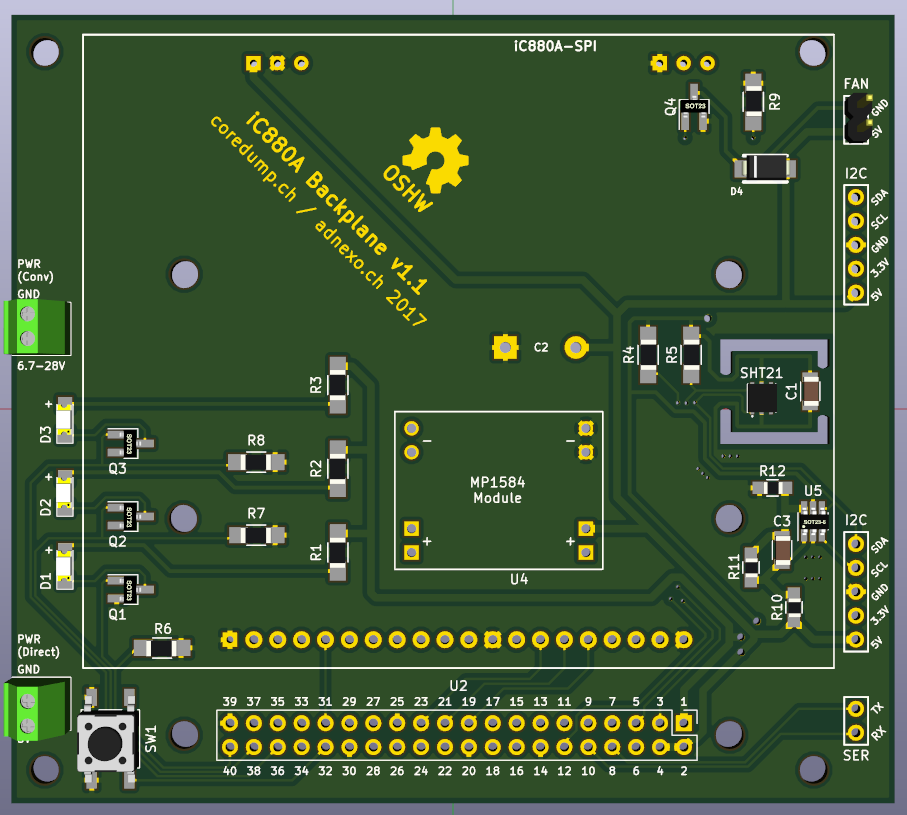
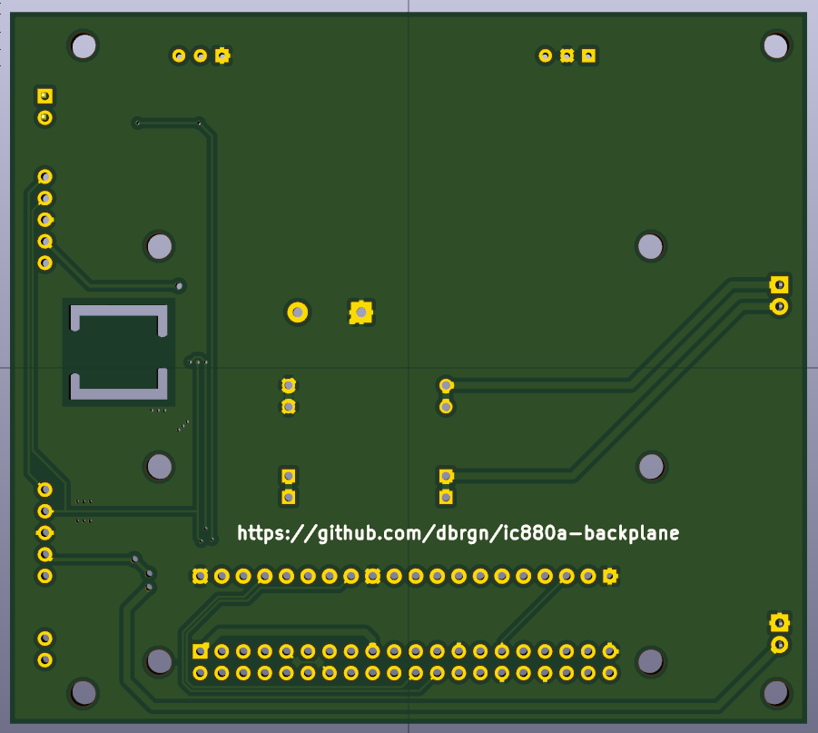

# iC880A + Raspberry Pi Backplane

*Buy this board at [shop.coredump.ch](https://shop.coredump.ch/product/ic880a-lorawan-gateway-backplane/)!*

This is a backplane to connect an iC880A-SPI concentrator board to a Raspberry
Pi. It is inspired by the [iC880A backplane by
@gonzalocasas](https://github.com/gonzalocasas/ic880a-backplane), but aims to
give you the following additional features:

Power

- Screw terminal and footprint for MP1584 step-down regulator module (6.7-28V)
- Screw terminal for direct power input/output (5V)
- Protection diode and resettable polyfuse against high voltage spikes
- Protection against reverse polarity power input

Headers

- Full access to Raspberry Pi GPIO header
- Pin header for serial communication (RX/TX)
- 2 Pin headers for I²C based sensors (SDA/SCL/GND/3.3V/5V)

Sensors

- A [SHT21](https://sensirion.com/sht21/) temperature/humidity sensor
- An MCP3425 16-bit ADC to measure RPi supply voltage

Other

- Pin header with flyback diode for 5V fan (5V/GND)
- General purpose button connected to GPIO pin (e.g. for controlled Raspi
  shutdown)
- Three general purpose SMD LEDs (Note: Only usable from Raspi versions
  with 40-pin GPIO header)
- Mounting holes for Raspberry Pi B+ / 2B / 3B / Zero

## PCB

## Schematics

See [schematics-v1.1.pdf](schematics-v1.1.pdf).

## Development

This PCB was created using KiCad 4.

Make sure that you clone all submodules:

    git submodule init
    git submodule update

## License

© 2017 Danilo Bargen. Licensed under the TAPR Open Hardware License (www.tapr.org/OHL).

If you make any modification to this board, it would be great if you could let
me know at mail@dbrgn.ch.
