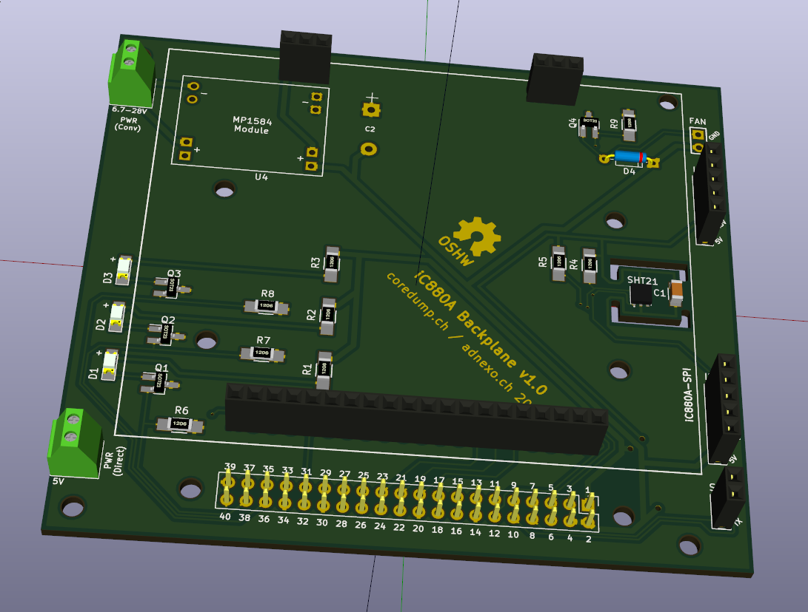

# iC880A + Raspberry Pi Backplane

This is a backplane to connect an iC880A-SPI concentrator board to a Raspberry
Pi. It is inspired by the [iC880A backplane by
@gonzalocasas](https://github.com/gonzalocasas/ic880a-backplane), but aims to
give you the following additional features:

Power

- Screw terminal and footprint for MP1584 step-down regulator (6.7-28V)
- Screw terminal for direct power input/output (5V)

Headers

- Full access to Raspberry Pi GPIO header
- Pin header for serial communication (RX/TX)
- 2 Pin headers for I²C based sensors (SDA/SCL/GND/3.3V/5V)

Sensors

- Footprint for a [SHT21](https://sensirion.com/sht21/) temperature/humidity
  sensor (SMD package)

Other

- Pin header with flyback diode for 5V fan (5V/GND)
- Footprint for three general purpose SMD LEDs
- Mounting holes for Raspberry Pi B+ / 2B / 3B / Zero

## PCB

## Schema

See [schema.pdf](schema.pdf).

## Development

This PCB was created using KiCad 4.

Make sure that you clone all submodules:

    git submodule init
    git submodule update

## License

© 2017 Danilo Bargen. Licensed under the TAPR Open Hardware License (www.tapr.org/OHL).

If you make any modification to this board, it would be great if you could let
me know at mail@dbrgn.ch.
